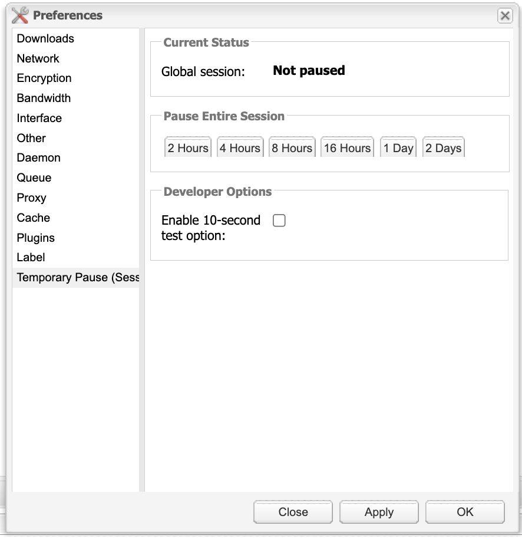
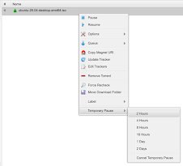

# TemporaryPause — Deluge Plugin

Pause downloads and uploads globally or per-torrent for a fixed duration (2/4/8/16 hours or 1/2 days), then auto-resume.

## Features

- **Global pause** — pauses the entire libtorrent session for a chosen duration, then auto-resumes
- **Per-torrent pause** — right-click any torrent(s) in the web UI → *Temporary Pause* submenu
- **Persistence** — pause state survives daemon restarts; remaining time is recalculated on startup
- **Web UI** — Preferences → Temporary Pause shows a live countdown and a Cancel button; torrents get a context menu submenu

Supported durations: **2 hours · 4 hours · 8 hours · 16 hours · 1 day · 2 days**

## Screenshots

### Preferences — Global Pause


### Torrent Context Menu — Per-Torrent Pause


## Requirements

- Deluge 2.x
- Python 3.x
- Nix (optional, for reproducible builds)

## Installation

### With Nix (recommended)

```bash
git clone https://github.com/johnpulford/deluge-temporary-pause
cd deluge-temporary-pause
nix run .#install
```

This builds the egg and copies it to `~/.config/deluge/plugins/`.

### Without Nix

```bash
git clone https://github.com/johnpulford/deluge-temporary-pause
cd deluge-temporary-pause
python setup.py bdist_egg
cp dist/*.egg ~/.config/deluge/plugins/
```

### Enable the plugin

1. Open Deluge Web UI → **Preferences → Plugins**
2. Enable **TemporaryPause**
3. Restart the daemon if needed: `systemctl restart deluged`

## Usage

### Global pause

Go to **Preferences → Temporary Pause** and click the duration button. The status section shows the remaining time and a Cancel button.

### Per-torrent pause

Right-click one or more torrents in the torrent list → **Temporary Pause** → choose a duration. To cancel, right-click again → **Temporary Pause → Cancel Temporary Pause**.

## Development

```bash
nix develop        # enter a shell with Python + setuptools
# edit source in deluge_temporarypause/
python setup.py bdist_egg
cp dist/*.egg ~/.config/deluge/plugins/
systemctl restart deluged
```

## File layout

```
setup.py
flake.nix
deluge_temporarypause/
  __init__.py          plugin entry points
  core.py              daemon-side logic — RPC methods, timers, persistence
  gtkui.py             GTK stub (unused on headless systems)
  webui.py             registers the JS file with Deluge's web server
  common.py            get_resource() path helper
  data/
    temporarypause.js  Ext.js web UI — preferences page + context menu
```

## RPC API

The core exposes these methods (accessible via `deluge.client.temporarypause.*` in JS or the Deluge RPC client):

| Method | Description |
|---|---|
| `pause_session(seconds)` | Pause the entire session |
| `cancel_session_pause()` | Cancel the global pause and resume immediately |
| `pause_torrent(torrent_id, seconds)` | Pause a single torrent |
| `cancel_torrent_pause(torrent_id)` | Cancel a per-torrent pause and resume it |
| `get_status()` | Return current pause state for session and all paused torrents |

## License

GPLv3
